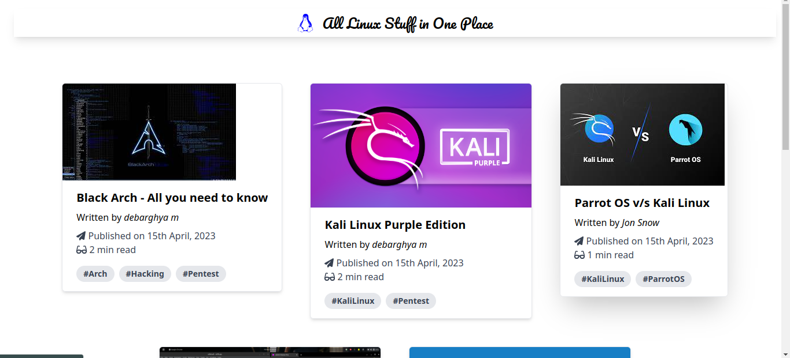
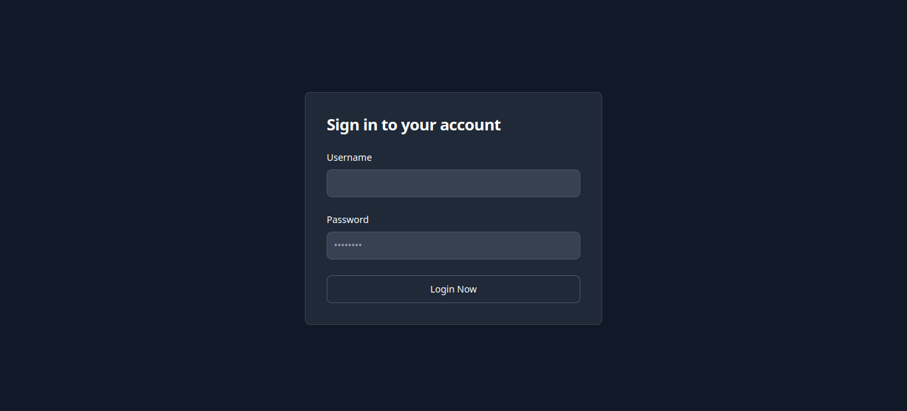
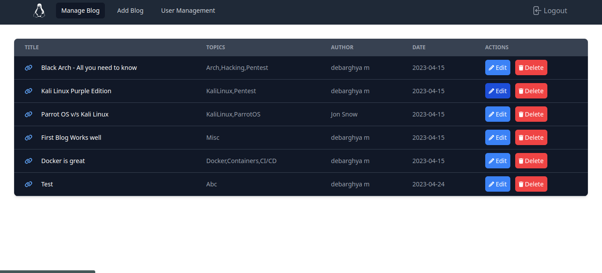
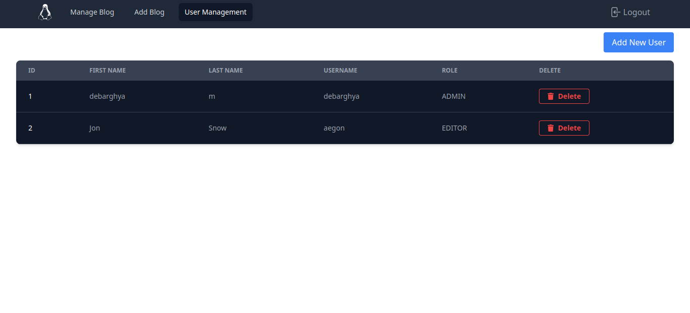
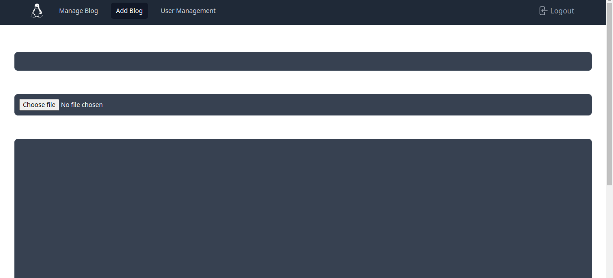

# Personal Blogs

## Overview:
- A simple web application to maintain personal blogs, built on `SpringBoot` and `NextJS`.
- A blogger can add maintainers to maintain and edit his/her personal blogs.
- A maintainer can only edit existing blogs of a fellow blogger.
- Only verified users can add blogs, but viewing them is publicly available.

## Screenshots:
### Main page(visible to everyone):



### Login screen:



### Blog management and blog adding pages:




### User management page:



## Usage:

- Using native dependencies(with Java 17, gradle, postgresql and node installed in system):
  - Build the backend:
  ```bash
  ./gradlew build -x test
  ``` 
  - Build the frontend:
  ```bash
  cd frontend/ && npm install && npm run build
  ```
  - Run the backend with java:
  ```bash
  java -jar {path_to_the_build_jarfile}
  ```
  - Run the frontend with node:
  ```bash
  node frontend/.next/standalone/server.js
  ```
- Using docker:
  ```
  docker compose up
  ```
- The jar file can also be downloaded from github assets.
